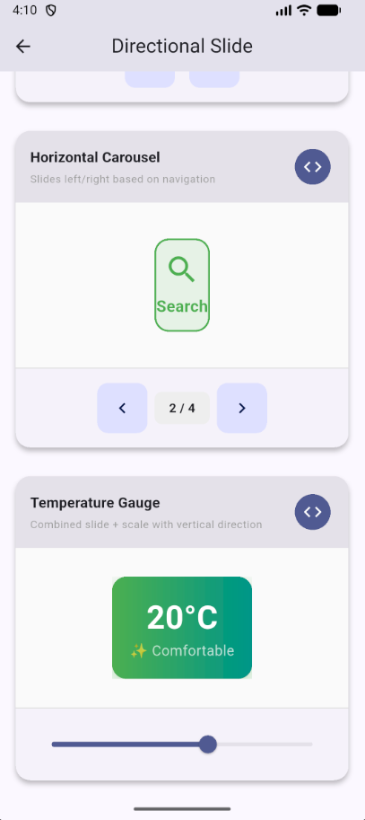

# Neuron

**Signal/Slot Reactive State Management for Flutter**

Neuron is a powerful, elegant reactive state management solution built around the Signal/Slot pattern. Designed for simplicity, performance, and exceptional developer experience.

[](https://pub.dev/packages/neuron)
[](test/)
[](test/)
[](LICENSE)
[](https://pub.dev/packages/flutter_lints)

## 🧠 What is Neuron?

Neuron brings **reactive programming** to Flutter with an intuitive Signal/Slot architecture. Think of **Signals** as reactive data containers that automatically notify their listeners when values change, and **Slots** as UI components that automatically rebuild when connected signals update.

### The Signal/Slot Philosophy

**Signals** are reactive values that emit changes:
```dart
final count = Signal<int>(0);
count.emit(5);  // Emits new value
```

**Slots** listen to signals and rebuild UI automatically:
```dart
Slot<int>(
  connect: count,
  to: (context, value) => Text('Count: $value'),
)
```

This pattern simplifies state management while providing fine-grained reactivity.

## ✨ Features

### 🎯 Core Reactive System
- **Signal/Slot Pattern**: Clean `emit()` and `connect()` API
- **Automatic UI Updates**: Connect signals to widgets, updates happen automatically
- **Fine-Grained Reactivity**: Only connected widgets rebuild, not entire trees
- **Type-Safe**: Full Dart type safety throughout
- **Memory Efficient**: Automatic cleanup and lifecycle management

### 🚀 Developer Experience
- **StatelessWidget Only**: Write clean functional components
- **Zero Boilerplate**: Minimal code required to connect state to UI
- **Service Locator Built-in**: Controller lifecycle managed automatically
- **Hot Reload Friendly**: Preserves state during development
- **Intuitive API**: Learn once, productive immediately

### ⚡ Advanced Signals
- **Computed Signals**: Derived values that auto-update from dependencies
- **Async Signals**: Built-in loading/error/data states for async operations
- **Collection Signals**: Reactive lists, maps, and sets with mutation methods
- **Rate-Limited Signals**: Debounce, throttle, and distinct filtering
- **Middleware Signals**: Transform, validate, and control value flow

### 🔧 Production-Ready Features
- **10+ Built-in Middlewares**: Validation, logging, clamping, sanitization, etc.
- **5 Persistence Adapters**: Auto-save/load with memory, JSON, binary, encrypted, versioned storage
- **Time-Travel Debugging**: Complete history tracking and state inspection
- **DevTools Integration**: Visual debugging and performance monitoring
- **Transaction Support**: Batch multiple updates atomically
- **Effect System**: Side effects and reactions to signal changes

## 📱 Gallery

See `AnimatedSlot` in action with these examples from the sample app:

| Animated Slot | Directional Slide | Blur Effects |
|:---:|:---:|:---:|
|  |  |  |

## 📦 Installation

Run this command:

```bash
flutter pub add neuron
```

Or add to your `pubspec.yaml`:

```yaml
dependencies:
  neuron: ^1.1.8
```

Then run:
```bash
flutter pub get
```

## 🚀 Quick Start

### 1. Create a Controller

```dart
import 'package:neuron/neuron.dart';

class CounterController extends NeuronController {
  late final count = Signal<int>(0).bind(this);
  late final doubled = Computed<int>(
    () => count.val * 2,
    [count],
  ).bind(this);

  void increment() => count.emit(count.val + 1);
  void decrement() => count.emit(count.val - 1);

  static CounterController get init =>
      Neuron.ensure<CounterController>(() => CounterController());
}
```

## 📚 Widget Guide

Neuron provides a rich set of widgets to handle various reactive scenarios.

### 1. Slot
The fundamental building block. Rebuilds when the connected signal changes.

```dart
Slot<int>(
  connect: counter,
  to: (context, value) => Text('Count: $value'),
)
```

### 2. AsyncSlot
Specialized slot for `AsyncSignal`s. Handles loading, error, and data states automatically.

```dart
AsyncSlot<User>(
  connect: userSignal,
  onLoading: (context) => CircularProgressIndicator(),
  onError: (context, error) => Text('Error: $error'),
  onData: (context, user) => UserProfile(user),
)
```

### 3. MultiSlot
Connect to multiple signals and rebuild when any of them changes.

```dart
MultiSlot2<String, int>(
  connect1: nameSignal,
  connect2: ageSignal,
  to: (context, name, age) => Text('$name is $age years old'),
)
```

### 4. ConditionalSlot
Conditionally renders widgets based on a boolean signal.


```dart

final isLoggedIn = Signal<bool>(false);

ConditionalSlot<bool>(
  connect: isLoggedIn,
  when: (val) => val,
  to: (context, _) => UserDashboard(),
  orElse: (context) => LoginPage(),
)
```

### 5. AnimatedSlot
Automatically animates value changes with built-in effects.

```dart
AnimatedSlot<int>(
  connect: counter,
  effect: SlotEffect.fade | SlotEffect.scale,
  curve: Curves.elasticOut,
  to: (context, value) => Text(
    '$value',
    style: TextStyle(fontSize: 32),
  ),
)
```

## 🎭 Animations & Effects

Neuron includes a suite of powerful animation widgets to bring your UI to life.

### AnimatedValueSlot
Smoothly interpolates between numeric values.

```dart
AnimatedValueSlot<double>(
  connect: progressSignal,
  duration: Duration(seconds: 1),
  format: (val) => '${(val * 100).toStringAsFixed(0)}%',
  to: (context, formatted) => Text(formatted),
)
```

### SpringSlot
Physics-based spring animations for natural motion.

```dart
SpringSlot<double>(
  connect: scaleSignal,
  spring: SpringConfig.bouncy,
  to: (context, scale) => Transform.scale(
    scale: scale,
    child: Card(),
  ),
)
```

### GestureAnimatedSlot
Combines gestures with press animations.

```dart
GestureAnimatedSlot<bool>(
  connect: isLikedSignal,
  onTap: () => isLikedSignal.emit(!isLikedSignal.val),
  pressedScale: 0.8,
  to: (context, isLiked) => Icon(
    isLiked ? Icons.favorite : Icons.favorite_border,
    color: isLiked ? Colors.red : Colors.grey,
  ),
)
```

### PulseSlot
Continuous pulsing animation for attention-grabbing elements.

```dart
PulseSlot<int>(
  connect: notificationCount,
  when: (count) => count > 0,
  to: (context, count) => Badge(label: Text('$count')),
)
```

### ShimmerSlot
Loading shimmer effect for async states.

```dart
ShimmerSlot<User?>(
  connect: userSignal,
  when: (user) => user == null,
  shimmer: Container(width: 100, height: 20, color: Colors.grey),
  to: (context, user) => Text(user!.name),
)
```

### 2. Use in StatelessWidget

```dart
class CounterPage extends StatelessWidget {
  @override
  Widget build(BuildContext context) {
    final c = CounterController.init;
    return Scaffold(
      body: Column(
        children: [
          Slot<int>(connect: c.count, to: (ctx, val) => Text('Count: $val')),
          ElevatedButton(onPressed: c.increment, child: Text('Increment')),
        ],
      ),
    );
  }
}
```

## 🧭 Navigation

Neuron provides a complete navigation system that works without `BuildContext`.

### Setup

Add `Neuron.navigatorKey` to your `MaterialApp`:

```dart
MaterialApp(
  navigatorKey: Neuron.navigatorKey,
  home: HomePage(),
);
// OR use NeuronApp wrapper
NeuronApp(
  home: HomePage(),
)
```

### Basic Navigation

```dart
// Go to a new page
Neuron.to(NextPage());

// Go back
Neuron.back();

// Replace current page
Neuron.off(LoginPage());

// Remove all previous pages
Neuron.offAll(DashboardPage());
```

### Named Routes

```dart
// Define routes
NeuronApp(
  initialRoute: '/',
  routes: [
    NeuronRoute(
      name: '/',
      path: '/',
      builder: (context, params) => HomePage(),
    ),
    NeuronRoute(
      name: '/details',
      path: '/details/:id',
      builder: (context, params) => DetailsPage(id: params['id']),
    ),
  ],
);

// Navigate
Neuron.toNamed('/details/123');
```

### Transitions

Neuron supports beautiful page transitions out of the box.

```dart
Neuron.to(
  NextPage(),
  transition: NeuronPageTransition.slideUp,
  duration: Duration(milliseconds: 400),
);
```

## ⚡ Effects & Reactions

React to signal changes without widgets.

### SignalReaction

Execute code when a signal changes.

```dart
final reaction = SignalReaction<int>(
  count,
  (value) {
    print('Count changed to $value');
    if (value > 10) showAlert();
  },
);

// Clean up
reaction.dispose();
```

### SignalTransaction

Batch multiple updates to notify listeners only once.

```dart
SignalTransaction()
  .update(firstName, 'John')
  .update(lastName, 'Doe')
  .commit();
```

### 3. Run Your App

```dart
void main() => runApp(NeuronApp(home: CounterPage()));
```

## 📚 Core Concepts

### Signals & Slots

**Signals** are reactive data containers. **Slots** are widgets that rebuild when signals change.

```dart
// Signal
final count = Signal<int>(0);

// Slot
Slot<int>(
  connect: count,
  to: (context, value) => Text('Value: $value'),
)
```

### Computed Signals

Computed signals automatically recalculate when dependencies change:

```dart
final width = Signal<double>(10);
final height = Signal<double>(20);
final area = Computed<double>(
  () => width.val * height.val,
  [width, height],
);
```

### AsyncSignal

Handles asynchronous operations with built-in loading, error, and data states.

```dart
final user = AsyncSignal<User>(null);

// Execute async operation
Future<void> loadUser() async {
  await user.execute(() => api.getUser());
}

// In UI
AsyncSlot<User>(
  connect: user,
  onData: (ctx, user) => Text(user.name),
  onLoading: (ctx) => CircularProgressIndicator(),
  onError: (ctx, error) => Text('Error: $error'),
)
```

### Collection Signals

Reactive Lists, Maps, and Sets.

```dart
final items = ListSignal<String>([]);
items.add('Hello');      // Emits change
items.remove('Hello');   // Emits change
```

### Rate Limiting

Control emission frequency with `DebouncedSignal`, `ThrottledSignal`, and `DistinctSignal`.

```dart
final search = Signal<String>('');
final debounced = DebouncedSignal(search, Duration(milliseconds: 300));
```

### Undo/Redo

`UndoableSignal` tracks history and supports undo/redo operations.

```dart
final text = UndoableSignal<String>('');
text.emit('Hello');
text.emit('World');
text.undo(); // 'Hello'
text.redo(); // 'World'
```

### Middleware

Intercept signal emissions to transform, validate, or control value flow.

```dart
final age = MiddlewareSignal<int>(
  0,
  middlewares: [
    ClampMiddleware(min: 0, max: 120),
    LoggingMiddleware(label: 'age'),
    HistoryMiddleware(limit: 10), // Track history
  ],
);
```

**Available Middlewares:**
- `LoggingMiddleware`: Log value changes.
- `ValidationMiddleware`: Prevent invalid values.
- `ClampMiddleware`: Constrain numeric values.
- `TransformMiddleware`: Modify values before emit.
- `SanitizationMiddleware`: Clean string values.
- `RateLimitMiddleware`: Limit update frequency.
- `ConditionalMiddleware`: Update only if condition met.
- `CoalesceMiddleware`: Handle nulls.
- `AggregateMiddleware`: Combine multiple middlewares.

### Persistence

Automatically save and restore signal state.

```dart
final theme = PersistentSignal<String>(
  'light',
  persistence: SimplePersistence(key: 'theme', ...),
);
```

**Persistence Adapters:**
- `SimplePersistence`: String-based storage (e.g., SharedPreferences).
- `JsonPersistence`: Store complex objects as JSON.
- `BinaryPersistence`: Efficient binary storage.
- `EncryptedPersistence`: Secure storage with encryption.
- `VersionedPersistence`: Handle data migration across versions.
- `MemoryPersistence`: Ephemeral storage for testing.

### Utilities

Helper methods for common tasks.

```dart
// Create from Stream
final streamSignal = SignalUtils.fromStream(myStream, initialValue);

// Create from Future
final futureSignal = SignalUtils.fromFuture(myFuture);

// Poll periodically
final pollSignal = SignalUtils.poll(fetchData, Duration(seconds: 5), initial);
```

### Animations

`AnimatedSlot`, `AnimatedFormSlot`, and `MorphSlot` provide beautiful reactive animations.

```dart
AnimatedSlot<int>(
  connect: count,
  effect: SlotEffect.fade | SlotEffect.scale,
  to: (context, value) => Text('$value'),
)
```

## 🛠️ DevTools & Debugging (Work in progress)

Neuron includes a powerful DevTools integration for debugging and performance monitoring.

> **Note**: This feature is currently a work in progress. The core infrastructure (Debug Server, WebSocket API) is fully functional, and the DevTools extension UI is coming soon!

### Setup

Enable DevTools in your `NeuronApp`:

```dart
void main() {
  runApp(
    NeuronApp(
      enableDevTools: true, // Default in debug mode
      maxDevToolsEvents: 500,
      home: MyApp(),
    ),
  );
}
```

### Features

1.  **Auto-Registration**: Signals bound to a controller with `.bind(this)` are automatically registered with DevTools.
2.  **Signal Inspector**: View all registered signals, current values, and listener counts.
3.  **Time Travel**: Inspect history and restore previous states.
4.  **Performance Monitor**: Track signal emit rates and build times.

### Debug Server

Neuron starts a unified Debug Server (WebSocket + HTTP) on port `9090` (or next available).
- **Dashboard**: `http://localhost:9090/ui`
- **API**: `/snapshot`, `/events`, `/health`

## 📊 Performance

Neuron is designed for high performance with minimal overhead.

- **Fast Updates**: Optimized for rapid state changes and UI rebuilds.
- **Low Memory Footprint**: Efficient signal implementation.
- **Minimal Boilerplate**: Concise syntax reduces code size.

## 🤝 Contributing

Contributions welcome! Please read [CONTRIBUTING.md](CONTRIBUTING.md) first.

## 📄 License

MIT License - see [LICENSE](LICENSE) file for details.
